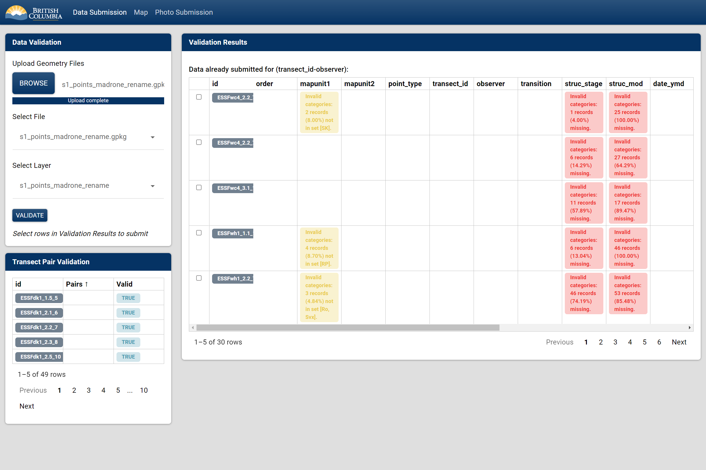
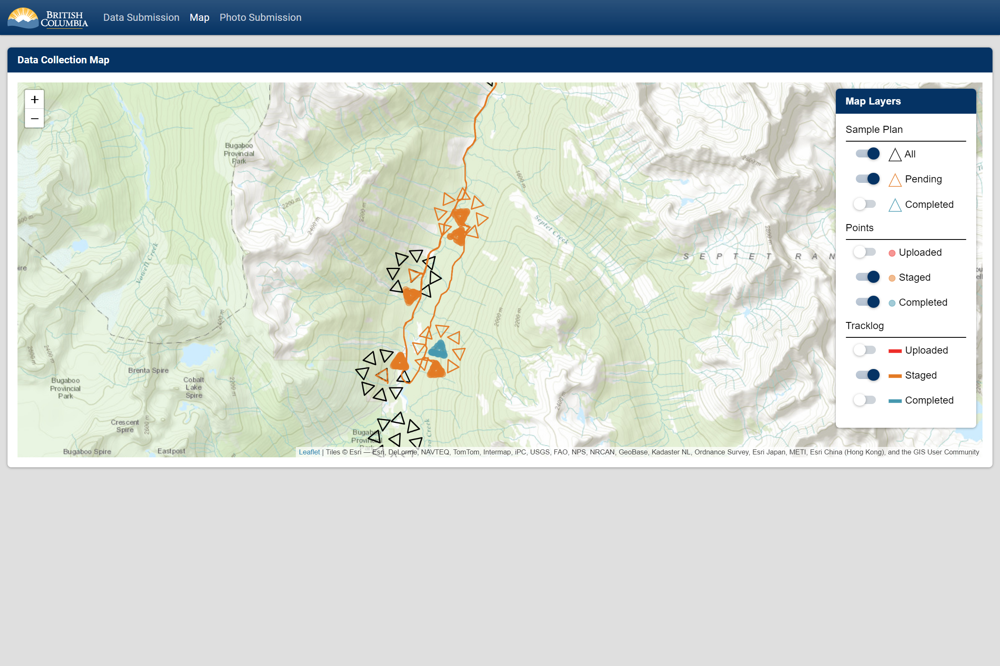
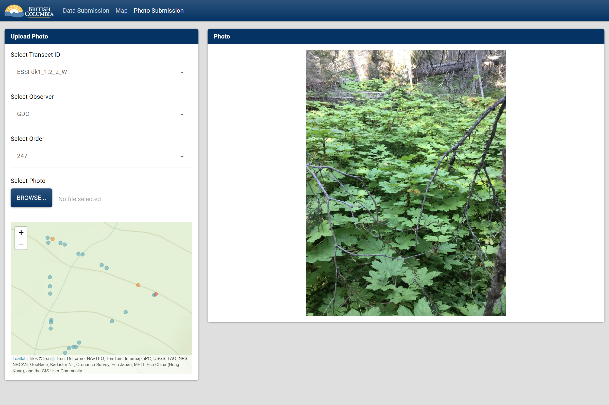

<!-- badges: start -->
[](<Redirect-URL>)
[](https://github.com/bcgov/PEMcollectr/actions/workflows/R-CMD-check.yaml)
<!-- badges: end -->

# PEMcollectr
A shiny app for uploading PEM field data.

#### Requirements

The shiny application runs with a postgresql database backend. To set up the 
database, a script is located in inst/pg that defines the appropriate 
schemas and adds a "app" user with privileges to perform the necessary 
database operations. Prior to running the application, the following 
environment variables will need to be set: PGHOST, PGUSER, and PGPASSWORD. 
See `?connect_pg` for details. In addition, sample plans need to be loaded 
outside of the app into the "transects.sample_plan" table. 

#### Installation

To install and run in deployment:


```
devtools::install_github('bcgov/PEMcollectr')
PEMcollectr::run_PEM_app(local = FALSE)
```

For local development the shiny app is located in inst/PEMcollectR. 
To run in a development environment while making changes. Either 
build the package (ctrl+shift+b in Rstudio) and run the following:

```
PEMcollectr::run_PEM_app(local = TRUE)
```

or run `devtools::load` (ctrl+shift+l in Rstudio), open the 
inst/PEMcollectR/ui.R or inst/PEMcollectR/ui.R and click Run App.

#### Data Submission

The module allows the users to upload point or tracklog data to a postgresql 
database. The data column-wise and if the dataset passes all tests. Then 
it can be loaded to a staging table. Datasets that have already been written to 
the database are omitted.



#### Map

The module reads data from the database and validated data from the Data 
Submission page to plot out the progress of the data collection. 




#### Photo submission

The module allows the user to add and view photos for data points that have 
been written to the database.


